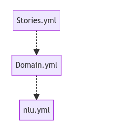
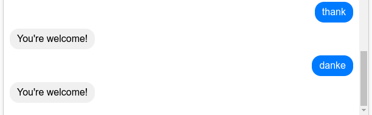
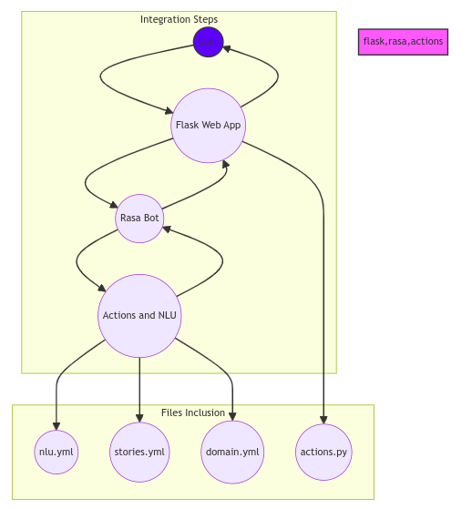

## working with Rasa Static Nlu

Rasa Static Nlu is a tool that allows you to use a pre-trained model to extract entities from text. This is useful when you have a fixed set of entities that you want to extract from text, and you don't need to train a model to extract them.

## working of Yml files to classify an enitity 

## working of Yml files to classify an enitity 

we can create a new story in the stories.yml file and then add the intent in the domain.yml file and then add the entity in the nlu.yml file.

## working of Yml files to classify an enitity 

User messages are classified as intents in the domain.yml file and then the entities are classified in the nlu.yml file. the stories.yml file is used to create a new story. stories actuallt refers to the conversation topics.
